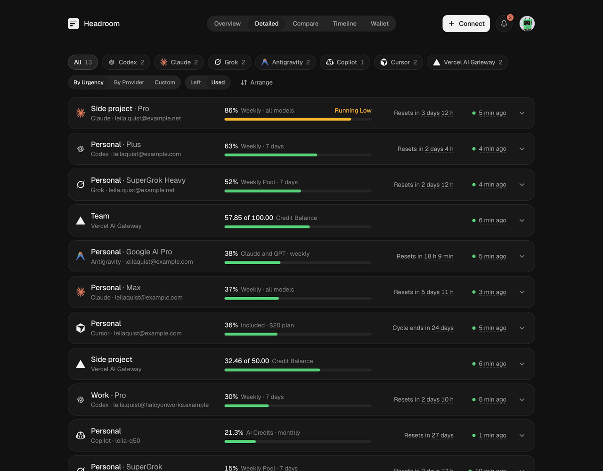
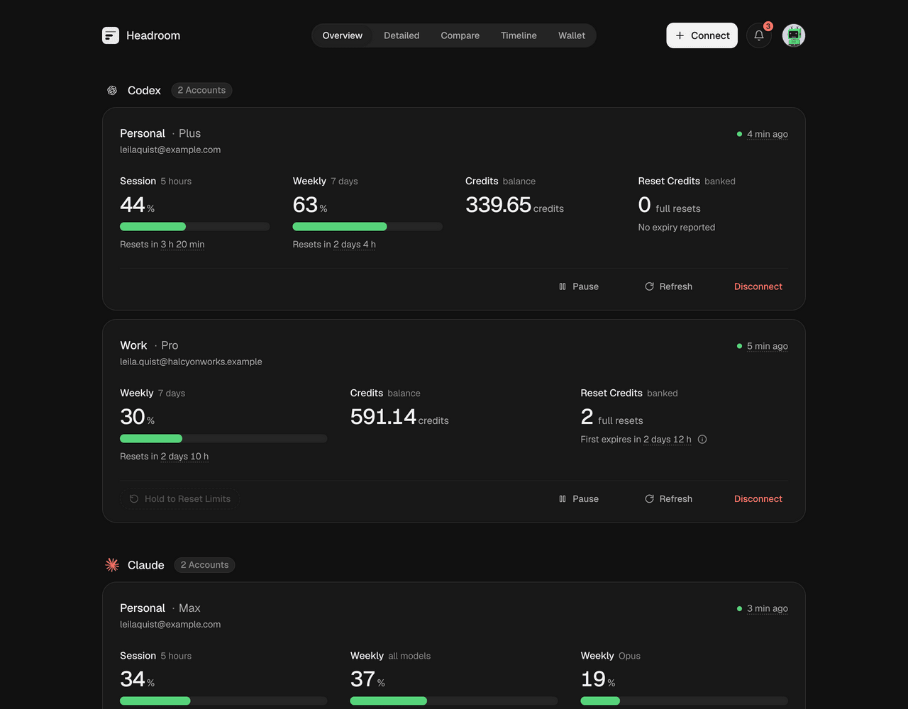
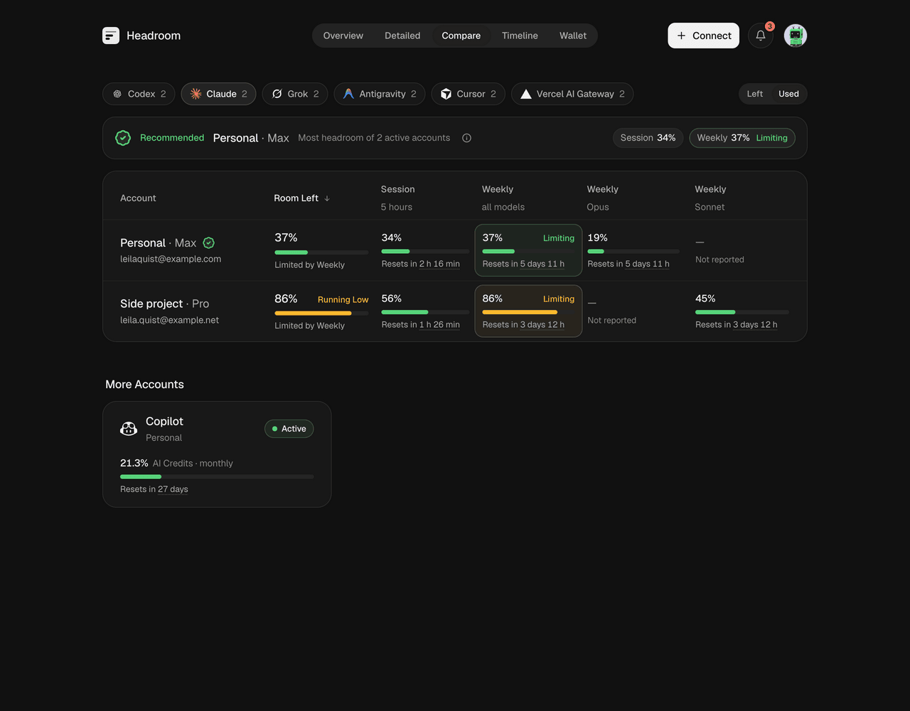
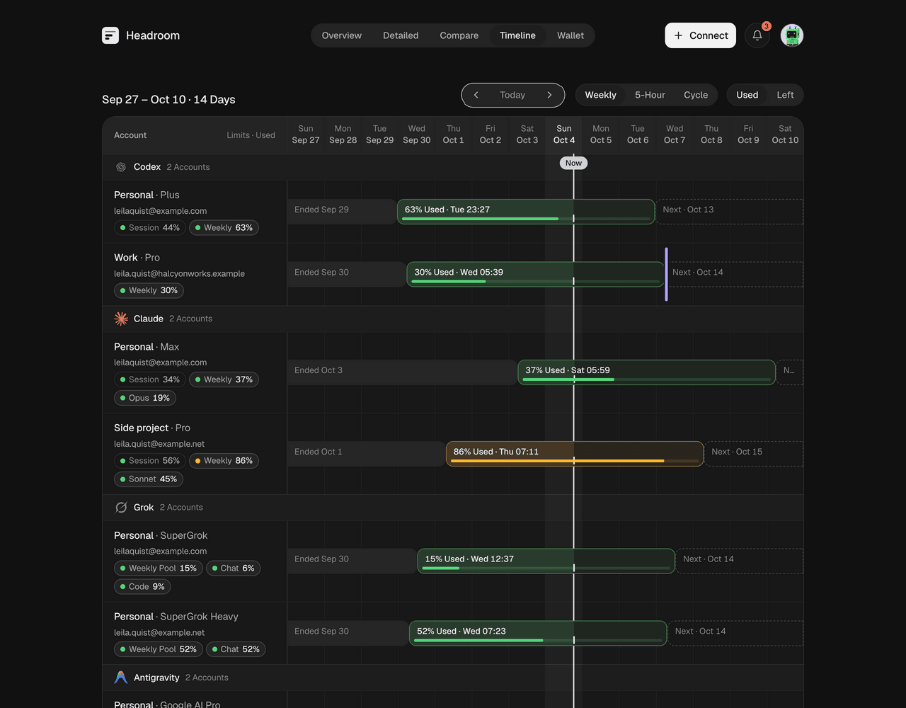
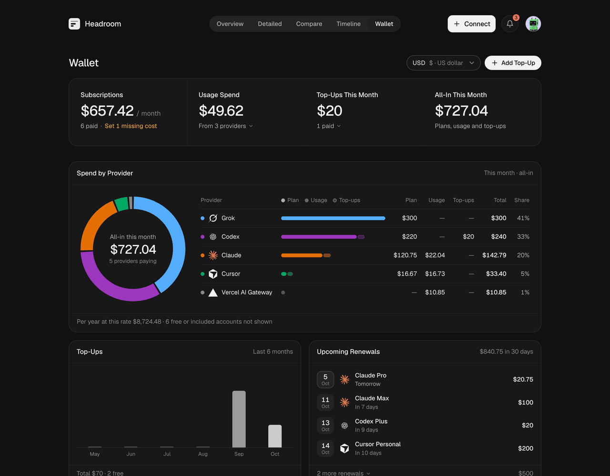
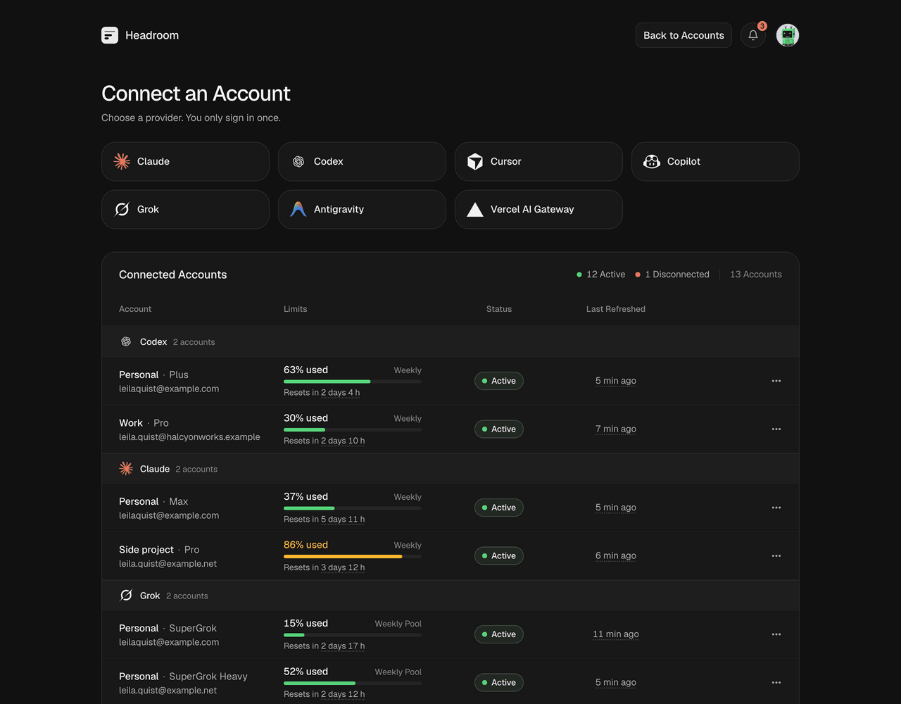
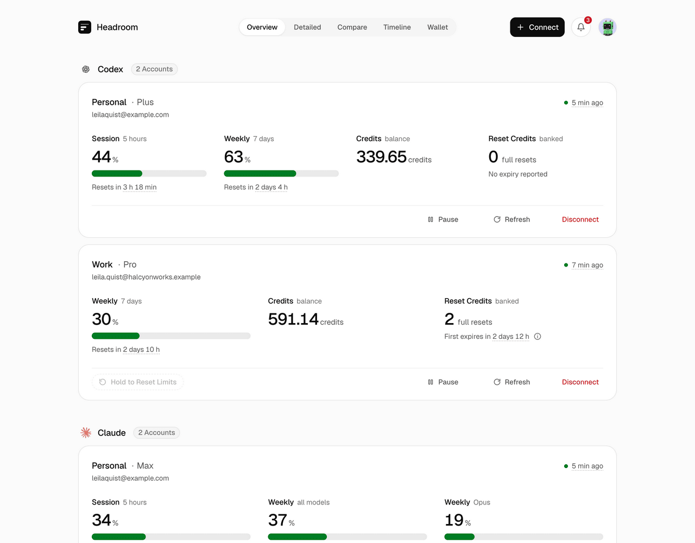
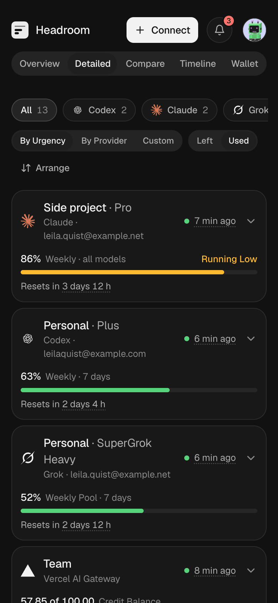
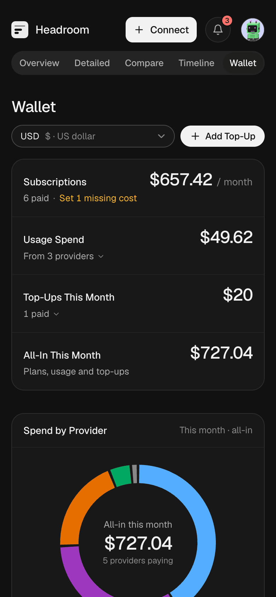
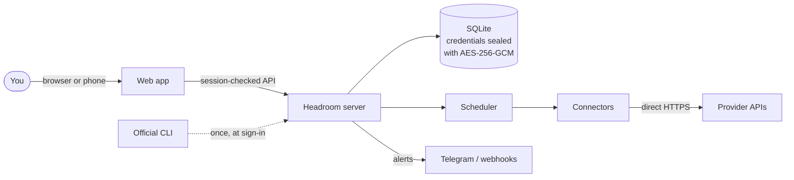

<div align="center">


# Headroom

**Every AI plan you pay for, on one screen.**

Self-hosted dashboard for Claude, Codex, Cursor, Copilot, Grok, Antigravity and Vercel AI Gateway.<br>
Live limits, resets, credits and spend for every account, with credentials encrypted on your own server.

[](https://github.com/amitray007/headroom/actions/workflows/ci.yml)
[](LICENSE)
[](#quick-start)
[](https://bun.sh)
[](tsconfig.json)
[](apps/web)
[](docs/architecture/data-model.md)
[](#docker)
[](CONTRIBUTING.md)
[](https://github.com/sponsors/amitray007)

[Live demo](https://headroom.theblank.club/) · [Quick start](#quick-start) · [Screenshots](#screenshots) · [Providers](#supported-providers) · [How it works](#how-it-works) · [Docs](docs/README.md)



<sub>All screenshots use Demo Mode: synthetic accounts on reserved <code>example</code> domains.</sub>

</div>

## Why Headroom

You pay for several AI plans, often more than one account each. Each one shows its limits somewhere else, in a different unit, with a different reset. You find out an account is spent when a request fails halfway through a task.

Headroom signs in to each account once, refreshes them in the background, and shows everything on one page: what is left, when it resets, which account to use next, and what it all costs.

## Why there is no cloud version

Headroom holds the sign-in tokens for every AI account you connect. A hosted copy would put everyone's tokens on one server that someone else runs, which defeats the purpose. Run it on a server you control, and your tokens stay there. There is no hosted Headroom, and none is planned.

## Features

- **Every limit in one place.** 5-hour sessions, weekly pools, per-model limits, credit balances, banked resets and on-demand spend, side by side.
- **Know which account to use next.** Compare ranks accounts of a provider by the room they have left and names the one to use.
- **See resets coming.** Timeline lays every window on a calendar, so you know when headroom comes back.
- **Track what you pay.** Wallet totals subscriptions, usage spend and top-ups in one currency, with upcoming renewals.
- **Get warned in time.** In-app notices, Telegram and signed webhooks for limits running low, new and expiring resets, early resets, your own spend budgets and broken sign-ins.
- **Automations you switch on.** Use a banked Codex reset when a limit runs out, and record credit top-ups in the Wallet as soon as a balance rises.
- **Many accounts per provider.** Personal, work and side-project accounts stay separate, each with its own credentials.
- **Private by design.** One owner, passkeys, encrypted credentials, and a Privacy Mode that blurs emails on screen.
- **Works on your phone.** Every view is built for small screens.

## Screenshots

| Overview | Compare |
| :---: | :---: |
|  |  |
| **Timeline** | **Wallet** |
|  |  |
| **Connect** | **Light theme** |
|  |  |

<p align="center">
  
  &nbsp;&nbsp;
  
</p>

## Supported providers

| Provider | Sign-in | What you see | Interface |
| --- | --- | --- | --- |
| Claude | Claude Code sign-in, or import `.credentials.json` | Session and weekly limits, per-model limits, extra-usage spend, reset grants | Private |
| Codex | Codex CLI device sign-in, or import `auth.json` | 5-hour and weekly limits, credits, banked reset credits | Private |
| Cursor | Browser approval | Included usage, Auto and API pools, Grok Bot, on-demand spend | Private |
| Copilot | GitHub device code, or import a `gh` token | AI credits, credits used, extra usage, chat and completions | Private |
| Grok | Grok CLI device sign-in, or import `auth.json` | Weekly pool, chat and code share, on-demand cap, prepaid balance | Private |
| Antigravity | Google sign-in, then paste the redirect | Gemini and Claude/GPT quota pools | Private |
| Vercel AI Gateway | API key | Credit balance, credits used, spend | Official |

- **Private:** the endpoint the provider's own app or CLI calls. It can change without notice.
- **Official:** a published API.
- **Enable providers** with `HEADROOM_ENABLED_PROVIDERS`. The commands above turn on all seven; without the variable, only Codex.
- **Evidence:** the [provider dossiers](docs/providers/README.md) record what is validated.

## How it works



- Sign in once. Where a provider needs it, its official CLI runs one time on the server to sign in. Headroom seals the result with a master key kept outside the database.
- Refresh in the background. The scheduler collects each account over direct HTTPS on your interval, refreshes tokens before they expire, and keeps 90 days of history by default.
- Read only by default. Monitoring never sends a model request, redeems a reset or buys credits. Using a banked Codex reset needs "Allow Account Actions" and either a press-and-hold or an auto-reset rule you set.
- Unknown is not zero. A figure a provider does not report shows as unknown, never as 0.

## Quick start

### Docker

```sh
docker run -d --name headroom -p 8080:8080 \
  -v headroom-data:/var/lib/headroom/data -v headroom-secrets:/etc/headroom \
  -e HEADROOM_ENABLED_PROVIDERS=codex,claude,grok,antigravity,copilot,cursor,vercel_ai_gateway \
  ghcr.io/amitray007/headroom:latest
```

Open <http://localhost:8080> and create the owner account. The first start creates the master key and the session secret in the `headroom-secrets` volume. Back up both volumes together: without the key, every account must be reconnected.

The same setup as a compose file is [deploy/compose.simple.yaml](deploy/compose.simple.yaml): `docker compose -f deploy/compose.simple.yaml up -d`. To reach Headroom from other devices, put an HTTPS reverse proxy in front and set `HEADROOM_PUBLIC_URL` to its address. Passkeys and secure cookies need HTTPS anywhere but localhost.

Image tags: `latest` is the newest release, `0.1.0` and `0.1` pin a release, and `edge` follows `main`. See [Releases](docs/operations/releases.md).

### Docker on a Tailscale tailnet

Headroom publishes no port. A Tailscale container serves it over HTTPS to your own devices only.

```sh
git clone https://github.com/amitray007/headroom.git && cd headroom/deploy
cp .env.example .env   # set TS_AUTHKEY and HEADROOM_PUBLIC_URL
docker compose up -d --build
```

Open `https://<TS_HOSTNAME>.<tailnet>.ts.net` and create the owner account. The full guide, including Dokploy and moving an existing instance, is in [Self-hosting on a tailnet](docs/operations/tailscale.md).

### From source

Requires [mise](https://mise.jdx.dev), which installs the pinned Bun.

```sh
mise install && mise run install
mise run start         # builds the web app and the binary, then serves on :8080
```

Open <http://localhost:8080>. Data goes to `.data/` and the two secret files to `.state/`. Back up `.state/headroom.key` with `.data/headroom.db`: without the key every account must be reconnected.

### Configuration

| Variable | Default | Purpose |
| --- | --- | --- |
| `HEADROOM_PUBLIC_URL` | none | The address you open Headroom at. Required behind a proxy; passkeys and cookies use it |
| `HEADROOM_ENABLED_PROVIDERS` | `codex` | Comma list: `codex`, `claude`, `grok`, `antigravity`, `copilot`, `cursor`, `vercel_ai_gateway` |
| `HEADROOM_PORT` | `8080` | HTTP port |
| `HEADROOM_DATA_DIR` | `.data` | Where the database lives |
| `HEADROOM_MASTER_KEY_FILE` | `.state/headroom.key` | The key that seals credentials. Keep it out of the data folder |

Every variable is listed in [Deployment and credential storage](docs/architecture/deployment.md).

## Security

- Credentials are sealed per account with AES-256-GCM. The master key never enters the database.
- One owner account, with username and password or passkeys. Sign-up closes after the first account.
- Provider requests time out, and a redirect to another host never carries your tokens.
- Provider errors are mapped to fixed messages, so raw responses never reach logs or the browser.
- Demo Mode swaps in synthetic data for screenshots, and Privacy Mode blurs identities on screen.

Report a vulnerability privately as described in [SECURITY.md](SECURITY.md).

## Development

```sh
mise run dev                  # API server with reload on :8080
mise exec -- bun run web:dev   # Vite on :5173, proxying /api to :8080
mise run check                # docs, format, lint, typecheck, knip and tests
```

```text
apps/server            Hono API, scheduler, notifications
apps/web               React 19 app
packages/core          Enumerations, stores, crypto, connector contract
packages/view-model    Presenters shared by every view, Demo Mode data
packages/connectors/*  One direct-HTTP client per provider
docs/                  Product, architecture, provider research, decisions
```

Start with [CONTRIBUTING.md](CONTRIBUTING.md) and the [documentation index](docs/README.md).

## Support

Headroom is free, and there is no paid cloud version. If it saves you a surprise limit, you can [sponsor its development](https://github.com/sponsors/amitray007). Sponsorship pays for connector fixes when a provider changes its API, new providers, releases and documentation.

## License

[MIT](LICENSE).

> [!NOTE]
> Headroom is an independent project, not affiliated with any provider listed above. Product names are trademarks of their owners.
>
> It is for personal self-hosted use. It reads your own accounts with your own credentials, and each provider's terms still apply.
